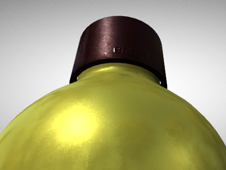
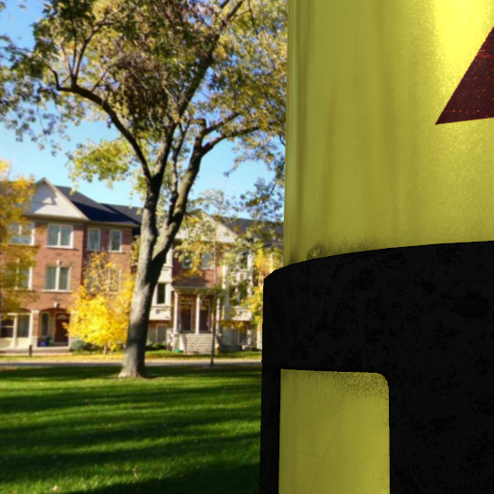
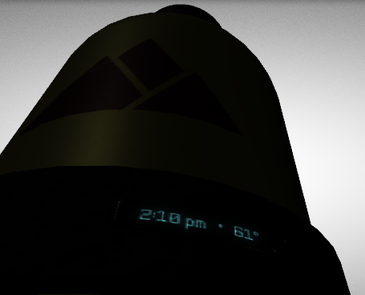
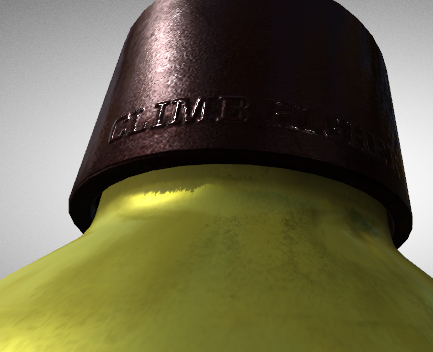

# 高级材料

这个[质感简单](https://github.com/KhronosGroup/glTF-Tutorials/blob/master/gltfTutorial/gltfTutorial_013_SimpleTexture.md)上一节中的示例显示了使用纹理定义“基础颜色”的材质。但是除了基色之外，材质的其他属性也可以通过纹理来定义。这些属性已在[材料](https://github.com/KhronosGroup/glTF-Tutorials/blob/master/gltfTutorial/gltfTutorial_010_Materials.md)章节：

- 这个*基色* ,
- 这个*金属的*价值观，
- 这个*粗糙度*表面上，
- 这个*发射的*属性，
- 安*闭塞*质地，以及
- A*法线贴图* .

这些属性的效果不能用简单的纹理来正确地演示。因此，这里将使用一个官方的Khronos-PBR样本模型，即[ 水瓶](https://github.com/KhronosGroup/glTF-Sample-Models/tree/master/2.0/WaterBottle)模型。图14a显示了此模型中涉及的纹理以及最终渲染对象的概述：

解释基于物理的渲染的实现超出了本教程的范围。官方的Khronos[WebGL PBR存储库](https://github.com/KhronosGroup/glTF-WebGL-PBR)包含基于WebGL的PBR呈现器的参考实现，并提供实现提示和背景信息。主要针对不同材质在不同光照条件下的效果进行演示。

图14b显示了粗糙纹理的效果：与瓶盖相比，瓶盖的表面结构粗糙度较低，使其显得有光泽。

图14c突出了金属纹理的效果：瓶子反射来自周围环境贴图的光。

图像14d显示了纹理的发射部分：无论暗环境设置如何，包含在发射纹理中的文本都清晰可见。

图14e显示了为其定义法线贴图的bottl cap部分：文本似乎被凸刻到cap中。这使得可以在曲面上建立更精细的几何细节模型，即使模型本身只有非常粗糙的几何分辨率。

这些纹理和贴图一起允许对各种真实世界的材质进行建模。由于通用的底层PBR模型，即金属粗糙度模型，可以通过不同的渲染器实现一致地渲染对象。