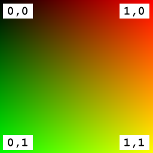

# 质感简单

如前几节所示，glTF资源中的材质定义包含不同的参数，用于材质的颜色或受灯光影响的材质的整体外观。这些属性可以通过单个值给出，例如，将对象的颜色或粗糙度定义为一个整体。或者，可以通过映射到对象表面上的纹理来提供这些值。以下是glTF资源，它定义了具有简单、单一纹理的材质：

```json
{
  "scenes" : [ {
    "nodes" : [ 0 ]
  } ],
  "nodes" : [ {
    "mesh" : 0
  } ],
  "meshes" : [ {
    "primitives" : [ {
      "attributes" : {
        "POSITION" : 1,
        "TEXCOORD_0" : 2
      },
      "indices" : 0,
      "material" : 0
    } ]
  } ],

  "materials" : [ {
    "pbrMetallicRoughness" : {
      "baseColorTexture" : {
        "index" : 0
      },
      "metallicFactor" : 0.0,
      "roughnessFactor" : 1.0
    }
  } ],

  "textures" : [ {
    "sampler" : 0,
    "source" : 0
  } ],
  "images" : [ {
    "uri" : "testTexture.png"
  } ],
  "samplers" : [ {
    "magFilter" : 9729,
    "minFilter" : 9987,
    "wrapS" : 33648,
    "wrapT" : 33648
  } ],

  "buffers" : [ {
    "uri" : "data:application/gltf-buffer;base64,AAABAAIAAQADAAIAAAAAAAAAAAAAAAAAAACAPwAAAAAAAAAAAAAAAAAAgD8AAAAAAACAPwAAgD8AAAAAAAAAAAAAgD8AAAAAAACAPwAAgD8AAAAAAAAAAAAAAAAAAAAAAACAPwAAAAAAAAAA",
    "byteLength" : 108
  } ],
  "bufferViews" : [ {
    "buffer" : 0,
    "byteOffset" : 0,
    "byteLength" : 12,
    "target" : 34963
  }, {
    "buffer" : 0,
    "byteOffset" : 12,
    "byteLength" : 96,
    "byteStride" : 12,
    "target" : 34962
  } ],
  "accessors" : [ {
    "bufferView" : 0,
    "byteOffset" : 0,
    "componentType" : 5123,
    "count" : 6,
    "type" : "SCALAR",
    "max" : [ 3 ],
    "min" : [ 0 ]
  }, {
    "bufferView" : 1,
    "byteOffset" : 0,
    "componentType" : 5126,
    "count" : 4,
    "type" : "VEC3",
    "max" : [ 1.0, 1.0, 0.0 ],
    "min" : [ 0.0, 0.0, 0.0 ]
  }, {
    "bufferView" : 1,
    "byteOffset" : 48,
    "componentType" : 5126,
    "count" : 4,
    "type" : "VEC2",
    "max" : [ 1.0, 1.0 ],
    "min" : [ 0.0, 0.0 ]
  } ],

  "asset" : {
    "version" : "2.0"
  }
}

```

纹理包含的实际图像存储为名为`"testTexture.png"`（参见图15a）



在渲染器中将所有这些集合在一起将导致在图像15b中渲染场景


## 纹理材质定义

此示例中的材质定义与[简单材料](https://github.com/KhronosGroup/glTF-Tutorials/blob/master/gltfTutorial/gltfTutorial_011_SimpleMaterial.md)这是早些时候展示的。虽然简单材质仅为整个对象定义了一种颜色，但材质定义现在引用了新添加的纹理：

```json
"materials" : [ {
  "pbrMetallicRoughness" : {
    "baseColorTexture" : {
      "index" : 0
    },
    "metallicFactor" : 0.0,
    "roughnessFactor" : 1.0
  }
} ],
```

这个`baseColorTexture`将应用于对象曲面的纹理的索引。这个` 金属因子`和`roughnessFactor`仍然是单一值。下一节将介绍一种更复杂的材质，其中这些属性也通过纹理来提供。

为了将纹理应用于网格基本体，必须有关于每个顶点应使用的纹理坐标的信息。纹理坐标只是中定义的顶点的另一个属性`mesh.primitive`. 默认情况下，纹理将使用具有属性名称的纹理坐标` TEXCOORD？0`. 如果有多组纹理坐标，可以通过添加`texCoord`纹理引用的属性：

```json
"baseColorTexture" : {
  "index" : 0,
  "texCoord": 2  
},
```

在这种情况下，纹理将使用名为`TEXCOORD_2` 