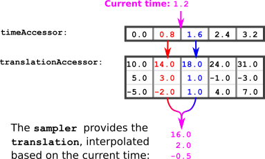
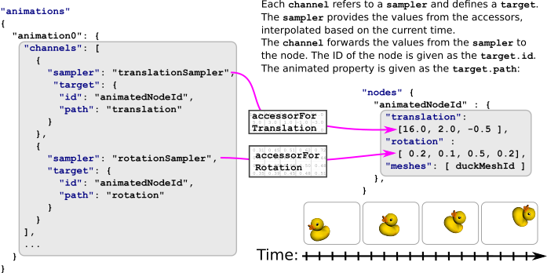

# 动画

如图所示[简单动画](https://github.com/KhronosGroup/glTF-Tutorials/blob/master/gltfTutorial/gltfTutorial_006_SimpleAnimation.md)例如，一个[`animation`](https://github.com/KhronosGroup/glTF/tree/master/specification/2.0/#reference-animation)可以用来描述`翻译` ,`rotation`，或`规模`节点的属性随时间而变化。

下面是另一个`animation`. 这一次，动画包含两个通道。一个设置平移动画，另一个设置节点旋转动画：

```json
"animations": [
    {
      "samplers" : [
        {
          "input" : 2,
          "interpolation" : "LINEAR",
          "output" : 3
        },
        {
          "input" : 2,
          "interpolation" : "LINEAR",
          "output" : 4
        }
      ],
      "channels" : [ 
        {
          "sampler" : 0,
          "target" : {
            "node" : 0,
            "path" : "rotation"
          }
        },
        {
          "sampler" : 1,
          "target" : {
            "node" : 0,
            "path" : "translation"
          }
        } 
      ]
    }
  ],
```

## 动画采样器

这个`samplers`包含数组[`animation.sampler`](https://github.com/KhronosGroup/glTF/tree/master/specification/2.0/#animation-sampler)定义访问器提供的值如何在关键帧之间插值的对象，如图7a所示。



为了计算当前动画时间的平移值，可以使用以下算法：

- 将当前动画时间设为`currentTime` .

- 计算下一个较小的元素和下一个较大的元素*时代*访问器：

  `previousTime`= The largest element from the*时代*小于`currentTime`

  `nextTime`= The smallest element from the*时代*大于`currentTime`

- 从中获取元素*翻译*与这些时间对应的存取器：

  `previousTranslation`= The element from the*翻译*对应于`previousTime`

  `nextTranslation`= The element from the*翻译*对应于`nextTime`

- 计算插值值。这是一个介于0.0和1.0之间的值，用于描述*相对的*位置`currentTime`，在` 以前的时间`以及`nextTime` :

  `interpolationValue = (currentTime - previousTime) / (nextTime - previousTime)`

- 使用插值值计算当前时间的平移：

  `currentTranslation = previousTranslation + interpolationValue * (nextTranslation - previousTranslation)`

### 例子：

想象一下`currentTime`是 **one point two**. 下一个较小的元素*时代*存取器是 **zero point eight**. 下一个更大的元素是 **one point six**. 所以

```json
previousTime = 0.8
nextTime     = 1.6
```

中的相应值*翻译*可以查找访问器：

```json
previousTranslation = (14.0, 3.0, -2.0)
nextTranslation     = (18.0, 1.0,  1.0)
```

插值值可以计算：

```json
interpolationValue = (currentTime - previousTime) / (nextTime - previousTime)
                   = (1.2 - 0.8) / (1.6 - 0.8)
                   = 0.4 / 0.8         
                   = 0.5
```

根据插值值，可以计算当前平移：

```c++
currentTranslation = previousTranslation + interpolationValue * (nextTranslation - previousTranslation)
                   = (14.0, 3.0, -2.0) + 0.5 * ( (18.0, 1.0,  1.0) - (14.0, 3.0, -2.0) )
                   = (14.0, 3.0, -2.0) + 0.5 * (4.0, -2.0, 3.0)
                   = (16.0, 2.0, -0.5)
```

所以当当前时间是 **one point two**，然后`translation`节点的 **(16.0, 2.0, -0.5)** .

## 动画通道

动画包含一个数组[`animation.channel`](https://github.com/KhronosGroup/glTF/tree/master/specification/2.0/#channel)物体。通道在输入（从采样器计算的值）和输出（动画节点属性）之间建立连接。因此，每个通道引用一个采样器，使用采样器的索引，并包含一个[`animation.channel.target`](https://github.com/KhronosGroup/glTF/tree/master/specification/2.0/#reference-target). 这个`目标`使用节点的索引引用节点，并包含`path`定义应设置动画的节点的属性。来自采样器的值将写入此属性。

在上面的示例中，动画有两个通道。两者都指向同一个节点。第一个通道的路径是指`translation`第二个通道的路径引用`旋转`节点的。因此，附加到节点的所有对象（网格）都将通过动画进行平移和旋转，如图7b所示。



## 插值

以上示例仅涵盖`LINEAR`插值。glTF资源中的动画可以使用三种插值模式：

- `STEP`
- `LINEAR`
- `CUBICSPLINE`

### 台阶

这个`STEP`插值不是真正的插值模式，它使对象从关键帧跳到关键帧*没有任何插值*. 当采样器定义步进插值时，只需从对应于`previousTime` .

### 线性的

线性插值正好对应于上面的例子。一般情况是：

计算`interpolationValue` :

```c++
interpolationValue = (currentTime - previousTime) / (nextTime - previousTime)
```

对于标量和向量类型，使用线性插值（通常称为`lerp`数学图书馆）。这里有一个“伪代码”实现供参考

```c++
 Point lerp(previousPoint, nextPoint, interpolationValue)
        return previousPoint + interpolationValue * (nextPoint - previousPoint)
```

在旋转表示为四元数的情况下，需要执行球形线性插值(`slerp`)在上一个值和下一个值之间：

```c++
Quat slerp(previousQuat, nextQuat, interpolationValue)
        var dotProduct = dot(previousQuat, nextQuat)
        
        //make sure we take the shortest path in case dot Product is negative
        if(dotProduct < 0.0)
            nextQuat = -nextQuat
            dotProduct = -dotProduct
            
        //if the two quaternions are too close to each other, just linear interpolate between the 4D vector
        if(dotProduct > 0.9995)
            return normalize(previousQuat + interpolationValue(nextQuat - previousQuat))

        //perform the spherical linear interpolation
        var theta_0 = acos(dotProduct)
        var theta = interpolationValue * theta_0
        var sin_theta = sin(theta)
        var sin_theta_0 = sin(theta_0)
        
        var scalePreviousQuat = cos(theta) - dotproduct * sin_theta / sin_theta_0
        var scaleNextQuat = sin_theta / sin_theta_0
        return scalePreviousQuat * previousQuat + scaleNextQuat * nextQuat
```

### 三次样条插值

三次样条插值不仅需要上一个关键帧和下一个关键帧的时间和值，还需要为每个关键帧提供一对切线向量来平滑关键帧点周围的曲线。

这些切线存储在动画通道中。对于动画采样器描述的每个关键帧，动画通道包含3个元素：

- 关键帧的输入切线
- 关键帧值
- 输出切线

输入和输出切线是标准化向量，需要根据关键帧的持续时间进行缩放，我们称之为deltaTime

```
 deltaTime = nextTime - previousTime
```

计算`currentTime`，需要从动画通道获取：

- 的输出切线方向`previousTime`关键帧
- 价值`previousTime`关键帧
- 价值`nextTime`关键帧
- 的输入切线方向`nextTime`关键帧

*注意：第一个关键帧的输入切线和最后一个关键帧的输出切线将被完全忽略*

若要计算关键帧的实际切线，需要将从通道获得的方向向量乘以`deltaTime`

```
previousTangent = deltaTime * previousOutputTangent
    nextTangent = deltaTime * nextInputTangent
```

数学函数在[附录C](https://github.com/KhronosGroup/glTF/tree/master/specification/2.0?ts=4#appendix-c-spline-interpolation)GLTF2.0规范的。

下面是相应的伪代码片段：

```
Point cubicSpline(previousPoint, previousTangent, nextPoint, nextTangent, interpolationValue)
        t = interpolationValue
        t2 = t * t
        t3 = t2 * t
        
        return (2 * t3 - 3 * t2 + 1) * previousPoint + (t3 - 2 * t2 + t) * previousTangent + (-2 * t3 + 3 * t2) * nextPoint + (t3 - t2) * nextTangent;
```

