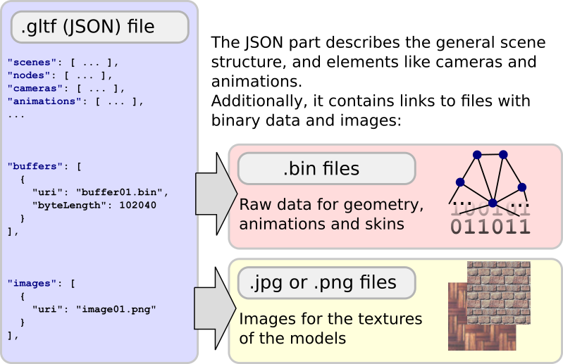

# glTF的基本结构

glTF的核心是一个JSON文件。这个文件描述了三维场景的全部内容。它包含对场景结构本身的描述，由定义场景图的节点层次给出。场景中显示的三维对象是使用附加到节点的网格定义的。材质定义对象的外观。动画描述了3D对象如何随时间变换（例如，旋转到平移），蒙皮定义了对象的几何体如何基于骨架姿势变形。摄影机描述渲染器的视图配置。

## JSON结构

场景对象存储在JSON文件中的数组中。可以使用数组中相应对象的索引访问它们：

```json
"meshes" : 
[
    { ... }
    { ... }
    ...
],
```

这些指数还用于定义*关系*在物体之间。上面的示例定义了多个网格，一个节点可以使用网格索引引用其中一个网格，以指示网格应附加到该节点：

```json
"nodes": 
[
    { "mesh": 0, ... },
    { "mesh": 5, ... },
    ...
]
```

下图（改编自[glTF概念部分](https://github.com/KhronosGroup/glTF/tree/master/specification/2.0/#concepts))概述了glTF资产JSON部分的顶层元素：


这些元素在这里进行了快速总结，以提供一个概述，并提供了到glTF规范的各个部分的链接。下面几节将对这些元素之间的关系进行更详细的解释。

- 这个[`scene`](https://github.com/KhronosGroup/glTF/tree/master/specification/2.0/#reference-scene)是存储在glTF中的场景描述的入口点。它指的是`节点`定义场景图
- 这个[`node`](https://github.com/KhronosGroup/glTF/tree/master/specification/2.0/#reference-node)是场景图层次中的一个节点。它可以包含一个变换（例如，旋转或平移），并且可以引用其他（子）节点。此外，它可能指`网格`或`camera`“附加”到节点或`皮肤`描述网格变形的
- 这个[`camera`](https://github.com/KhronosGroup/glTF/tree/master/specification/2.0/#reference-camera)定义用于渲染场景的视图配置。
- A[`mesh`](https://github.com/KhronosGroup/glTF/tree/master/specification/2.0/#reference-mesh)描述出现在场景中的几何对象。它指的是`存取器`用于访问实际几何数据的对象，以及`material`定义对象呈现时的外观。
- 这个[`skin`](https://github.com/KhronosGroup/glTF/tree/master/specification/2.0/#reference-skin)定义顶点蒙皮所需的参数，该蒙皮允许基于虚拟角色的姿势变形网格。这些参数的值从`存取器` .
- 安[`animation`](https://github.com/KhronosGroup/glTF/tree/master/specification/2.0/#reference-animation)描述特定节点的变换（例如旋转或平移）如何随时间变化。
- 这个[`accessor`](https://github.com/KhronosGroup/glTF/tree/master/specification/2.0/#reference-accessor)用作任意数据的抽象源。它由`网格` ,`skin`，和`动画`，并提供几何体数据、蒙皮参数和与时间相关的动画值。它指的是[`bufferView`](https://github.com/KhronosGroup/glTF/tree/master/specification/2.0/#reference-bufferView)，它是[`buffer`](https://github.com/KhronosGroup/glTF/tree/master/specification/2.0/#reference-buffer)包含实际原始二进制数据的。
- 这个[`material`](https://github.com/KhronosGroup/glTF/tree/master/specification/2.0/#reference-material)包含定义对象外观的参数。通常指`纹理`将应用于渲染几何体的对象。
- 这个[`texture`](https://github.com/KhronosGroup/glTF/tree/master/specification/2.0/#reference-texture)定义为[`sampler`](https://github.com/KhronosGroup/glTF/tree/master/specification/2.0/#reference-sampler)还有一个[`image`](https://github.com/KhronosGroup/glTF/tree/master/specification/2.0/#reference-image). 这个`采样器`定义纹理的方式`image`应该放在物体上

## 对外部数据的引用

二进制数据，比如3D对象的几何体和纹理，通常不包含在JSON文件中。相反，它们存储在专用文件中，JSON部分只包含指向这些文件的链接。这使得二进制数据可以以非常紧凑的形式存储，并且可以通过web高效地传输。此外，数据可以以可直接在渲染器中使用的格式存储，而无需解析、解码或预处理数据。



如上图所示，有两种类型的对象可能包含到外部资源的链接，即`buffers`和`图像`. 稍后将更详细地解释这些对象。

## 读取和管理外部数据

读取和处理glTF资产从解析JSON结构开始。结构被解析后[`buffer`](https://github.com/KhronosGroup/glTF/tree/master/specification/2.0/#reference-buffer)和[`image`](https://github.com/KhronosGroup/glTF/tree/master/specification/2.0/#reference-image)对象在顶层可用`缓冲器`和`images`数组。这些对象中的每一个都可以引用二进制数据块。为了进一步处理，这些数据被读入内存。通常，数据将存储在一个数组中，以便可以使用引用`缓冲器`或`image`它们所属的对象

## 二进制数据输入`buffers`

A[`buffer`](https://github.com/KhronosGroup/glTF/tree/master/specification/2.0/#reference-buffer)包含指向包含原始二进制缓冲区数据的文件的URI：

```json
"buffer01": {
    "byteLength": 12352,
    "type": "arraybuffer",
    "uri": "buffer01.bin"
}
```

此二进制数据只是从的URI读取的原始内存块`buffer`，没有内在的意义和结构。这个[缓冲区、缓冲区视图和访问器]buffer-bufferviews-accessors.md)第节将展示如何用有关数据类型和数据布局的信息扩展原始数据。利用该信息，例如，数据的一部分可以解释为动画数据，而另一部分可以解释为几何数据。以二进制形式存储数据使其能够比JSON格式更有效地通过web传输，并且二进制数据可以直接传递到呈现器，而不必对其进行解码或预处理。

## 图像数据输入`images`

安[`image`](https://github.com/KhronosGroup/glTF/tree/master/specification/2.0/#reference-image)可以引用可以用作渲染对象纹理的外部图像文件：

```json
"image01": {
    "uri": "image01.png"
}
```

引用以URI的形式给出，通常指向PNG或JPG文件。这些格式大大减小了文件的大小，以便可以通过web高效地传输。在某些情况下`image`对象不能引用外部文件，但可以引用存储在`缓冲器`. 此间接寻址的详细信息将在[纹理、图像和采样器](TexturesImagesSamplers.md)第节

## 数据uri中的二进制数据

通常，包含在`buffer`和`image`对象将指向包含实际数据的文件。作为替代，数据可以是*嵌入的*通过使用[数据URI](https://developer.mozilla.org/en-US/docs/Web/HTTP/Basics_of_HTTP/Data_URIs) .