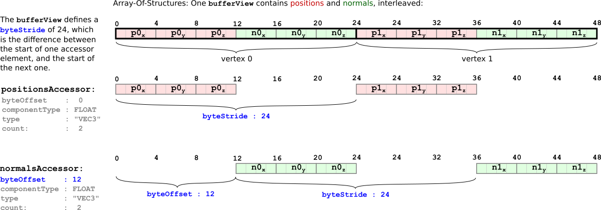
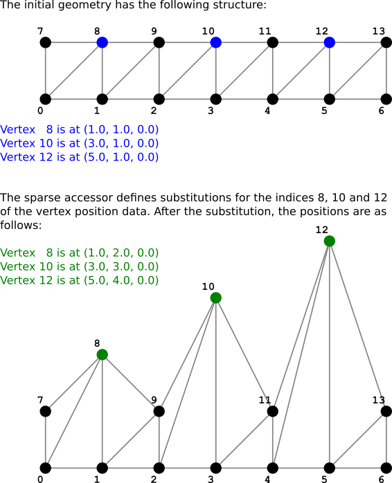

# 缓冲区、缓冲区视图和访问器

一个例子`buffer` ,` 缓冲视图`，和`accessor`对象已在[最小glTF文件](https://github.com/KhronosGroup/glTF-Tutorials/blob/master/gltfTutorial/gltfTutorial_003_MinimalGltfFile.md)第节。本节将更详细地解释这些概念。

## 缓冲器

A[`buffer`](https://github.com/KhronosGroup/glTF/tree/master/specification/2.0/#reference-buffer)表示原始二进制数据块，没有固有的结构或含义。缓冲区使用`uri`. 此URI可以指向外部文件，也可以是[数据URI](https://github.com/KhronosGroup/glTF-Tutorials/blob/master/gltfTutorial/gltfTutorial_002_BasicGltfStructure.md#binary-data-in-buffers)它直接在JSON文件中对二进制数据进行编码。这个[最小glTF文件](https://github.com/KhronosGroup/glTF-Tutorials/blob/master/gltfTutorial/gltfTutorial_003_MinimalGltfFile.md)包含一个`buffer`，包含44个字节的数据，编码在数据URI中：

```json
"buffers" : [
    {
      "uri" : "data:application/octet-stream;base64,AAABAAIAAAAAAAAAAAAAAAAAAAAAAIA/AAAAAAAAAAAAAAAAAACAPwAAAAA=",
      "byteLength" : 44
    }
  ],
```


a的部分数据`buffer`可能必须作为顶点属性或索引传递给渲染器，或者数据可能包含蒙皮信息或动画关键帧。为了能够使用此数据，需要有关此数据的结构和类型的附加信息。

## 缓冲视图

从`buffer`与[`bufferView`](https://github.com/KhronosGroup/glTF/tree/master/specification/2.0/#reference-bufferView)物体。A` 缓冲视图`表示一个缓冲区的数据的“切片”。此切片使用偏移量和长度（以字节为单位）定义。这个[最小glTF文件](https://github.com/KhronosGroup/glTF-Tutorials/blob/master/gltfTutorial/gltfTutorial_003_MinimalGltfFile.md)定义为二`bufferView`物体：

```json
"bufferViews" : [
    {
      "buffer" : 0,
      "byteOffset" : 0,
      "byteLength" : 6,
      "target" : 34963
    },
    {
      "buffer" : 0,
      "byteOffset" : 8,
      "byteLength" : 36,
      "target" : 34962
    }
  ],
```

第一个`bufferView`指缓冲区数据的前6个字节。第二个是指缓冲区的36个字节，偏移量为8个字节，如图所示：


浅灰色显示的字节是正确对齐访问器所需的填充字节，如下所述。

每个`bufferView`另外还包含`目标`财产。渲染器稍后可能会使用此属性对缓冲区视图所引用的数据的类型或性质进行分类。这个`target`可以是一个常量，指示数据用于顶点属性(` thirty-four thousand nine hundred and sixty-two`，代表`ARRAY_BUFFER`)，或者数据用于顶点索引(` thirty-four thousand nine hundred and sixty-three`，代表`ELEMENT_ARRAY_BUFFER` ).

在这一点上`buffer`数据被分成多个部分，每个部分由一个部分描述` 缓冲视图`. 但是为了在渲染器中真正使用这些数据，需要有关数据类型和布局的附加信息。

## 访问器

安[`accessor`](https://github.com/KhronosGroup/glTF/tree/master/specification/2.0/#reference-accessor)对象引用` 缓冲视图`并且包含定义此的数据的类型和布局的属性`bufferView` .

### 数据类型

访问器的数据类型编码在`type`以及` 组件类型`属性。的价值`type`属性是一个字符串，用于指定数据元素是标量、向量还是矩阵。例如，值可以是`“标量”`对于标量值，`"VEC3"`对于3D矢量，或`“材料4”`对于4×4个矩阵

这个`componentType`指定这些数据元素的组件的类型。这是一个GL常量，例如` five thousand one hundred and twenty-six` (`FLOAT`)或者` five thousand one hundred and twenty-three` (`UNSIGNED_SHORT`)，表示元素具有`浮动`或`unsigned short`分别是组件

这些属性的不同组合可用于描述任意数据类型。例如[最小glTF文件](https://github.com/KhronosGroup/glTF-Tutorials/blob/master/gltfTutorial/gltfTutorial_003_MinimalGltfFile.md)包含两个访问器：

```json
"accessors" : [
    {
      "bufferView" : 0,
      "byteOffset" : 0,
      "componentType" : 5123,
      "count" : 3,
      "type" : "SCALAR",
      "max" : [ 2 ],
      "min" : [ 0 ]
    },
    {
      "bufferView" : 1,
      "byteOffset" : 0,
      "componentType" : 5126,
      "count" : 3,
      "type" : "VEC3",
      "max" : [ 1.0, 1.0, 0.0 ],
      "min" : [ 0.0, 0.0, 0.0 ]
    }
  ],
```

第一个访问器引用`bufferView`索引为0，它定义`缓冲器`包含索引的数据。它`type`是`“标量”`，以及它的`componentType`是` five thousand one hundred and twenty-three` (`UNSIGNED_SHORT`). 这意味着索引存储为标量`无符号短`价值观

第二个访问器引用`bufferView`索引1，它定义了`缓冲器`包含顶点属性（尤其是顶点位置）的数据。它`type`是`“VEC3”`，以及它的`componentType`是` five thousand one hundred and twenty-six` (`FLOAT`). 所以这个存取器用浮点组件来描述三维向量。

### 数据布局

的附加属性`accessor`进一步指定数据的布局。这个`计数`属性指示它由多少个数据元素组成。在上面的例子中，计数是`3`对于两个访问器，分别代表三角形的三个索引和三个顶点。每个访问器还具有` 字节偏移量`财产。对于上面的例子，它已经`0`因为只有一个访问者`存取器`为每一个`bufferView`. 但是当多个访问器引用同一个` 缓冲视图`，然后`byteOffset`描述访问器的数据相对于` 缓冲视图`它所指的

### 数据对齐

被引用的数据`accessor`可以发送到显卡进行渲染，也可以在主机端用作动画或蒙皮数据。因此`存取器`必须根据*类型*数据的。例如，当`componentType`一个`存取器`是`5126` (`浮动`)，则数据必须在4字节边界对齐，因为`float`值由四个字节组成。这种对齐要求`存取器`指其`bufferView`以及潜在的`缓冲器`. 具体来说，线形要求如下：

- 这个`byteOffset`一个`存取器`必须可以被它的大小整除`componentType` .
- 的总和`byteOffset`访问器和` 字节偏移量`的`bufferView`它所指的必须被它的大小整除` 组件类型` .

在上面的示例中`byteOffset`的` 缓冲视图`索引1（指顶点属性）被选为`8`，以便将顶点位置访问器的数据与4字节边界对齐。字节` six`和`7`的`缓冲器`因此*衬垫*不携带相关数据的字节。

图5c演示了`buffer`结构使用` 缓冲视图`对象，并使用`accessor`物体


### 数据交织

存储在单个`bufferView`可以存储为*结构物阵列*. 单曲`bufferView`例如，可以以交错方式包含顶点位置和顶点法线的数据。在这种情况下` 字节偏移量`访问器的定义了各自属性的第一个相关数据元素的开始，并且`bufferView`定义一个附加的` byteStride公司`财产。这是访问器的一个元素的开始与下一个元素的开始之间的字节数。交错位置和法线属性如何存储在`bufferView`如图5d所示



### 数据内容

安`accessor`还包含`最小`和`max`汇总其数据内容的属性。它们是访问器中包含的所有数据元素的组件最小值和最大值。在顶点位置的情况下`最小`和`max`因此，属性定义*边界框*一个物体的。这对于确定下载的优先级或可见性检测非常有用。一般来说，这些信息对于存储和处理也是有用的*量子化*由渲染器在运行时取消量化的数据，但此量化的详细信息超出了本教程的范围。

## 稀疏存取器

在2.0版本中*稀疏存取器*是在glTF中引入的。这是一种特殊的数据表示，它允许非常紧凑地存储只有几个不同条目的多个数据块。例如，当存在包含顶点位置的几何体数据时，该几何体数据可用于多个对象。这可以通过参考相同的方法来实现`accessor`从两个对象。如果两个对象的顶点位置基本相同，并且只有几个顶点不同，则无需将整个几何体数据存储两次。相反，可以只存储一次数据，并使用稀疏访问器仅存储与第二个对象不同的顶点位置。

下面是一个完整的glTF资产，在嵌入式表示中，显示了稀疏访问器的示例：

```json
{
  "scenes" : [ {
    "nodes" : [ 0 ]
  } ],
  
  "nodes" : [ {
    "mesh" : 0
  } ],
  
  "meshes" : [ {
    "primitives" : [ {
      "attributes" : {
        "POSITION" : 1
      },
      "indices" : 0
    } ]
  } ],
  
  "buffers" : [ {
    "uri" : "data:application/gltf-buffer;base64,AAAIAAcAAAABAAgAAQAJAAgAAQACAAkAAgAKAAkAAgADAAoAAwALAAoAAwAEAAsABAAMAAsABAAFAAwABQANAAwABQAGAA0AAAAAAAAAAAAAAAAAAACAPwAAAAAAAAAAAAAAQAAAAAAAAAAAAABAQAAAAAAAAAAAAACAQAAAAAAAAAAAAACgQAAAAAAAAAAAAADAQAAAAAAAAAAAAAAAAAAAgD8AAAAAAACAPwAAgD8AAAAAAAAAQAAAgD8AAAAAAABAQAAAgD8AAAAAAACAQAAAgD8AAAAAAACgQAAAgD8AAAAAAADAQAAAgD8AAAAACAAKAAwAAAAAAIA/AAAAQAAAAAAAAEBAAABAQAAAAAAAAKBAAACAQAAAAAA=",
    "byteLength" : 284
  } ],
  
  "bufferViews" : [ {
    "buffer" : 0,
    "byteOffset" : 0,
    "byteLength" : 72,
    "target" : 34963
  }, {
    "buffer" : 0,
    "byteOffset" : 72,
    "byteLength" : 168
  }, {
    "buffer" : 0,
    "byteOffset" : 240,
    "byteLength" : 6
  }, {
    "buffer" : 0,
    "byteOffset" : 248,
    "byteLength" : 36
  } ],
  
  "accessors" : [ {
    "bufferView" : 0,
    "byteOffset" : 0,
    "componentType" : 5123,
    "count" : 36,
    "type" : "SCALAR",
    "max" : [ 13 ],
    "min" : [ 0 ]
  }, {
    "bufferView" : 1,
    "byteOffset" : 0,
    "componentType" : 5126,
    "count" : 14,
    "type" : "VEC3",
    "max" : [ 6.0, 4.0, 0.0 ],
    "min" : [ 0.0, 0.0, 0.0 ],
    "sparse" : {
      "count" : 3,
      "indices" : {
        "bufferView" : 2,
        "byteOffset" : 0,
        "componentType" : 5123
      },
      "values" : {
        "bufferView" : 3,
        "byteOffset" : 0
      }
    }
  } ],
  
  "asset" : {
    "version" : "2.0"
  }
}
```

渲染该资源的结果如图5e所示：


该示例包含两个访问器：一个用于网格的索引，另一个用于顶点位置。引用顶点位置的那个定义了一个附加的`accessor.sparse`属性，其中包含有关应应用的稀疏数据替换的信息：

```json
"accessors" : [ 
  ...
  {
    "bufferView" : 1,
    "byteOffset" : 0,
    "componentType" : 5126,
    "count" : 14,
    "type" : "VEC3",
    "max" : [ 6.0, 4.0, 0.0 ],
    "min" : [ 0.0, 0.0, 0.0 ],
    "sparse" : {
      "count" : 3,
      "indices" : {
        "bufferView" : 2,
        "byteOffset" : 0,
        "componentType" : 5123
      },
      "values" : {
        "bufferView" : 3,
        "byteOffset" : 0
      }
    }
  } ],
```

这个`sparse`对象本身定义`计数`将受替换影响的元素。这个`sparse.indices`属性引用` 缓冲视图`包含要替换的元素的索引。这个`sparse.values`指的是` 缓冲视图`包含实际数据的

在本例中，原始几何数据存储在`bufferView`索引为1。它描述了一个顶点的矩形数组。这个`稀疏.index`请参阅`bufferView`包含索引2的索引` [8, 10, 12]`. 这个`sparse.values`指` 缓冲视图`包含新顶点位置的索引3，即，`[(1,2,0), (3,3,0), (5,4,0)]`. 应用相应替换的效果如图5f所示。

