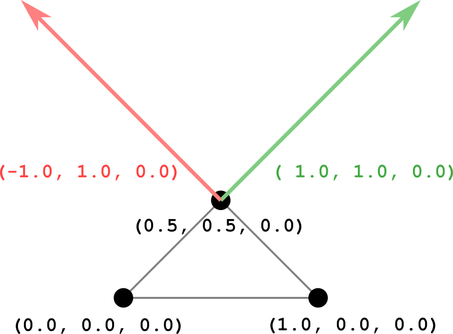
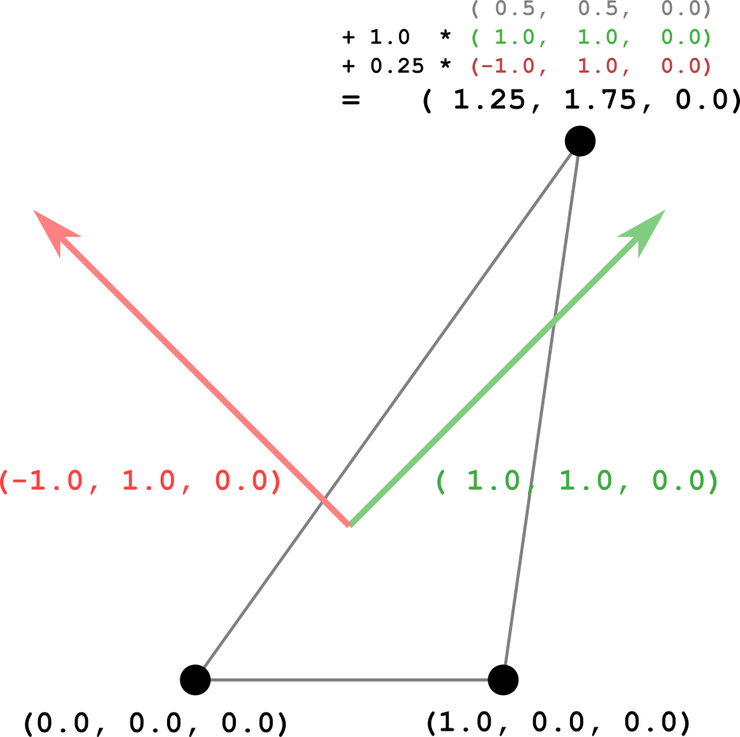

# 变形目标

上一节中的示例包含一个网格，该网格由一个三角形和两个变形目标组成：

```json
{
  "meshes":[
    {
      "primitives":[
        {
          "attributes":{
            "POSITION":1
          },
          "targets":[
            {
              "POSITION":2
            },
            {
              "POSITION":3
            }
          ],
          "indices":0
        }
      ],
      "weights":[
        1.0,
        0.5
      ]
    }
  ],

```

网格的实际基础几何体，即三角形几何体，由`mesh.primitive`已调用属性`“职位”`. 的变形目标`mesh.primitive`是映射属性名称的字典`“职位”`到`accessor`包含*位移*对于每个顶点。图18a以黑色显示初始三角形几何体，红色显示第一个变形目标的位移，绿色显示第二个变形目标的位移。



这个`weights`确定如何将这些变形目标置换添加到初始几何体，以获得几何体的当前状态。计算网格渲染顶点位置的伪代码`原始的`具体如下：

```
renderedPrimitive.POSITION = primitive.POSITION + 
  weights[0] * primitive.targets[0].POSITION +
  weights[1] * primitive.targets[1].POSITION;

```

这意味着网格图元的当前状态是通过获取初始网格图元几何体并添加变形目标置换的线性组合来计算的，其中`weights`是线性组合的因素

资产还包含`animation`影响变形目标的权重。下表显示了动画权重的关键帧：

| 时间  | 重量     |
| ----- | -------- |
| zero  | 0.0, 0.0 |
| one   | 0.0, 1.0 |
| two   | 1.0, 1.0 |
| three | 1.0, 0.0 |
| four  | 0.0, 0.0 |

在整个动画中，权重被线性插值，并应用于变形目标置换。在每个点上，网格基本体的渲染状态都会相应地更新。以下是以1.25秒计算的状态示例。

