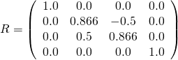

# 场景和节点

## 场景

可能有多个场景存储在一个glTF文件中，但在许多情况下，只有一个场景，这也是默认场景。每个场景包含一个数组`nodes`，它们是场景图的根节点的索引。同样，可能有多个根节点，形成不同的层次，但在许多情况下，场景将只有一个根节点。最简单的场景描述已经在上一节中给出，它由一个场景和一个节点组成：

```json
"scenes" : [
    {
      "nodes" : [ 0 ]
    }
  ],

  "nodes" : [
    {
      "mesh" : 0
    }
  ],
```

## 构成场景图的节点

每个[`node`](https://github.com/KhronosGroup/glTF/tree/master/specification/2.0/#reference-node)可以包含一个名为`儿童`包含其子节点的索引的。因此，每个节点都是节点层次结构中的一个元素，它们一起将场景的结构定义为场景图。


中给出的每个节点`scene`可以遍历，递归访问其所有子节点，以处理附加到节点的所有元素。此遍历的简化伪代码如下所示：

```
traverse(node) {
    // Process the meshes, cameras, etc., that are
    // attached to this node - discussed later
    processElements(node);

    // Recursively process all children
    for each (child in node.children) {
        traverse(child);
    }
}
```

实际上，遍历将需要一些附加信息：处理附加到节点的某些元素将需要有关*哪一个*它们附加到的节点。此外，在遍历过程中必须积累有关节点变换的信息。

### 局部和全局变换

每个节点都可以有一个变换。这样的变换将定义平移、旋转和/或缩放。此转换将应用于附加到节点本身及其所有子节点的所有元素。因此，节点的层次结构允许构建应用于场景元素的平移、旋转和缩放。

#### 节点的局部变换

节点的局部变换有不同的可能表示形式。转换可以直接由`matrix`属性。这是一个由16个浮点数组成的数组，它们按列的主要顺序描述矩阵。例如，下面的矩阵描述了关于（2,1,0.5）的缩放、围绕x轴旋转约30度以及关于（10,20,30）的平移：

```json
"node0": {
    "matrix": [
        2.0,    0.0,    0.0,    0.0,
        0.0,    0.866,  0.5,    0.0,
        0.0,   -0.25,   0.433,  0.0,
       10.0,   20.0,   30.0,    1.0
    ]
}    
```

此处定义的矩阵如图4b所示。


也可以使用`translation` ,`旋转`，和`scale`节点的属性，有时缩写为 *TRS公司* :

```
"node0": {
    "translation": [ 10.0, 20.0, 30.0 ],
    "rotation": [ 0.259, 0.0, 0.0, 0.966 ],
    "scale": [ 2.0, 1.0, 0.5 ]
}
```

这些属性中的每一个都可以用来创建矩阵，这些矩阵的乘积就是节点的局部变换：

- 这个`translation`只包含x，y，z方向的平移。例如，从` [ 10.0, 20.0, 30.0 ]`，可以创建一个转换矩阵，将此转换作为其最后一列，如图4c所示。


- 这个`rotation`作为一个[四元数](https://en.wikipedia.org/wiki/Quaternion). 四元数的数学背景超出了本教程的范围。现在，最重要的信息是四元数是绕任意角度和任意轴旋转的紧凑表示。例如，四元数`[ 0.259, 0.0, 0.0, 0.966 ]`描述绕x轴旋转约30度。所以这个四元数可以转换成旋转矩阵，如图4d所示。



- 这个`scale`包含沿x、y和z轴的比例因子。通过使用这些比例因子作为矩阵对角线上的条目，可以创建相应的矩阵。例如，比例因子的比例矩阵` [ 2.0, 1.0, 0.5 ]`如图4e所示


当计算节点的最终局部变换矩阵时，这些矩阵被相乘在一起。把这些矩阵按正确的顺序相乘是很重要的。局部变换矩阵必须计算为`M = T * R * S`，其中`T`矩阵是`translation`部分，`R`矩阵是`rotation`部分，以及`S`矩阵是`scale`部分。所以计算的伪代码是

```
translationMatrix = createTranslationMatrix(node.translation);
rotationMatrix = createRotationMatrix(node.rotation);
scaleMatrix = createScaleMatrix(node.scale);
localTransform = translationMatrix * rotationMatrix * scaleMatrix;
```

对于上面给出的示例矩阵，节点的最终局部变换矩阵如图4f所示。


然后根据网格的顶点进行平移，然后根据网格的大小进行缩放`scale` ,`旋转`，和`translation`在节点中给定的属性

当这三个属性中的任何一个未给定时，将使用单位矩阵。类似地，当一个节点既不包含`matrix`属性或TRS属性，则其局部变换将成为单位矩阵。

#### 节点的全局变换

可以将JSON文件存储为4的本地表示形式×4矩阵。这个*全球的*节点的变换由从根到相应节点的路径上所有局部变换的乘积给出：

```
Structure:           local transform      global transform
root                 R                    R
 +- nodeA            A                    R*A
     +- nodeB        B                    R*A*B
     +- nodeC        C                    R*A*C
```

必须指出的是，在加载文件后，这些全局转换可以*不*只计算一次。稍后，将展示如何*动画*可以修改单个节点的局部变换。这些修改将影响所有子节点的全局变换。因此，当需要对一个节点进行全局变换时，必须直接从所有节点的当前局部变换中进行计算。另外，作为一种潜在的性能改进，实现可以缓存全局转换，检测祖先节点的本地转换中的更改，并仅在必要时更新全局转换。不同的实现选项将取决于编程语言和客户机应用程序的需求，因此超出了本教程的范围。


