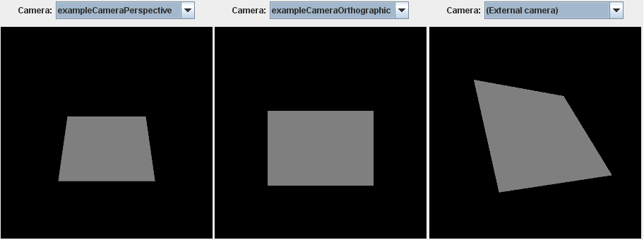

# 简单的照相机

前面的部分介绍了如何在glTF资源中表示具有几何对象的基本场景结构，以及如何将不同的材质应用于这些对象。这还不包括有关应用于渲染场景的视图配置的信息。这种视图配置通常被描述为虚拟的*照相机*它包含在场景中的某个位置，指向某个方向。

下面是一个简单、完整的glTF资产。它类似于已经显示的资产：它定义了一个简单的`scene`包含`节点`对象和单个几何对象作为`mesh`，附加到其中一个节点。但是这个资产还包含两个[`camera`](https://github.com/KhronosGroup/glTF/tree/master/specification/2.0/#reference-camera)物体：

```json
{
  "scenes" : [
    {
      "nodes" : [ 0, 1, 2 ]
    }
  ],
  "nodes" : [
    {
      "rotation" : [ -0.383, 0.0, 0.0, 0.924 ],
      "mesh" : 0
    },
    {
      "translation" : [ 0.5, 0.5, 3.0 ],
      "camera" : 0
    },
    {
      "translation" : [ 0.5, 0.5, 3.0 ],
      "camera" : 1
    }
  ],

  "cameras" : [
    {
      "type": "perspective",
      "perspective": {
        "aspectRatio": 1.0,
        "yfov": 0.7,
        "zfar": 100,
        "znear": 0.01
      }
    },
    {
      "type": "orthographic",
      "orthographic": {
        "xmag": 1.0,
        "ymag": 1.0,
        "zfar": 100,
        "znear": 0.01
      }
    }
  ],

  "meshes" : [
    {
      "primitives" : [ {
        "attributes" : {
          "POSITION" : 1
        },
        "indices" : 0
      } ]
    }
  ],

  "buffers" : [
    {
      "uri" : "data:application/octet-stream;base64,AAABAAIAAQADAAIAAAAAAAAAAAAAAAAAAACAPwAAAAAAAAAAAAAAAAAAgD8AAAAAAACAPwAAgD8AAAAA",
      "byteLength" : 60
    }
  ],
  "bufferViews" : [
    {
      "buffer" : 0,
      "byteOffset" : 0,
      "byteLength" : 12,
      "target" : 34963
    },
    {
      "buffer" : 0,
      "byteOffset" : 12,
      "byteLength" : 48,
      "target" : 34962
    }
  ],
  "accessors" : [
    {
      "bufferView" : 0,
      "byteOffset" : 0,
      "componentType" : 5123,
      "count" : 6,
      "type" : "SCALAR",
      "max" : [ 3 ],
      "min" : [ 0 ]
    },
    {
      "bufferView" : 1,
      "byteOffset" : 0,
      "componentType" : 5126,
      "count" : 4,
      "type" : "VEC3",
      "max" : [ 1.0, 1.0, 0.0 ],
      "min" : [ 0.0, 0.0, 0.0 ]
    }
  ],

  "asset" : {
    "version" : "2.0"
  }
}

```

此资源中的几何体是一个简单的单位正方形。它围绕x轴旋转-45度，以强调不同相机的效果。图15a显示了渲染此资源的三个选项。第一个示例使用资源中的摄影机。最后一个示例显示了从外部用户定义的视点来看场景的外观。



## 摄像机定义

这个glTF资产的新的顶层元素是`cameras`数组，其中包含[`camera`](https://github.com/KhronosGroup/glTF/tree/master/specification/2.0/#reference-camera)物体：

```json
"cameras" : [
  {
    "type": "perspective",
    "perspective": {
      "aspectRatio": 1.0,
      "yfov": 0.7,
      "zfar": 100,
      "znear": 0.01
    }
  },
  {
    "type": "orthographic",
    "orthographic": {
      "xmag": 1.0,
      "ymag": 1.0,
      "zfar": 100,
      "znear": 0.01
    }
  }
],

```

定义摄影机对象后，可以将其附着到`node`. 这是通过将摄影机的索引指定给`照相机`节点的属性。在给定示例中，场景图中添加了两个新节点，每个摄影机一个节点：

```json
"nodes" : {
  ...
  {
    "translation" : [ 0.5, 0.5, 3.0 ],
    "camera" : 0
  },
  {
    "translation" : [ 0.5, 0.5, 3.0 ],
    "camera" : 1
  }
},

```

透视和正交摄影机之间的差异及其属性、将摄影机附加到节点的效果以及多个摄影机的管理将在中详细说明[摄像机](cameras.md)第节

