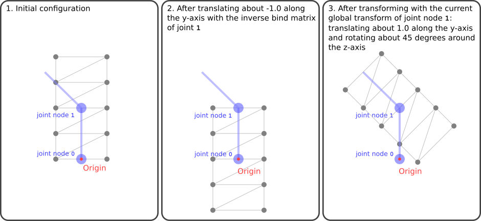

# 皮肤

顶点蒙皮的过程有点复杂。它汇集了glTF资产中包含的几乎所有元素。本节将根据中的示例解释顶点蒙皮的基础知识[单纯皮肤](https://github.com/KhronosGroup/glTF-Tutorials/blob/master/gltfTutorial/gltfTutorial_019_SimpleSkin.md)第节

## 几何数据

顶点蒙皮示例的几何体是一个索引三角形网格，由8个三角形和10个顶点组成。它们在xy平面上形成一个矩形，左下角点在原点（0,0,0），右上角点在（1,2,0）。所以顶点的位置是

```
0.0, 0.0, 0.0,
1.0, 0.0, 0.0,
0.0, 0.5, 0.0,
1.0, 0.5, 0.0,
0.0, 1.0, 0.0,
1.0, 1.0, 0.0,
0.0, 1.5, 0.0,
1.0, 1.5, 0.0,
0.0, 2.0, 0.0,
1.0, 2.0, 0.0

```

三角形的指数是

```
0, 1, 3,
0, 3, 2,
2, 3, 5,
2, 5, 4,
4, 5, 7,
4, 7, 6,
6, 7, 9,
6, 9, 8,

```

原始数据存储在第一个`buffer`. 索引和顶点位置由` 缓冲视图`索引0和1处的对象，以及相应的`accessor`索引0和1处的对象提供对这些缓冲区视图的类型化访问。图20a显示了这个几何体和轮廓渲染，以更好地显示结构。


该几何体数据包含在唯一网格的网格基本体中，该网格附加到场景的主节点。网格基本体包含其他属性，即`"JOINTS_0"`和`“权重\u 0”`属性。下面将解释这些属性的用途。

## 骨架结构

在给定的示例中，有两个节点定义骨架。它们被称为“骨架节点”或“关节节点”，因为它们可以想象为骨骼骨骼之间的关节。这个`skin`引用这些节点，方法是在`关节`财产

```
  "nodes" : [ 
   ...
   {
    "children" : [ 2 ],
    "translation" : [ 0.0, 1.0, 0.0 ]
   }, 
   {
    "rotation" : [ 0.0, 0.0, 0.0, 1.0 ]
   }
  ],


```

第一个关节节点具有`translation`属性，定义沿y轴约1.0的平移。第二个关节节点具有`旋转`属性，该属性最初描述了大约0度的旋转（因此根本没有旋转）。该旋转稍后将由动画更改，以使骨架左右弯曲并显示顶点蒙皮的效果。

## 皮肤

这个`skin`是顶点蒙皮的核心元素。在本例中，只有一个蒙皮：

```
  "skins" : [ 
   {
    "inverseBindMatrices" : 4,
    "joints" : [ 1, 2 ]
   }
  ],


```

皮肤包含一个名为`joints`，其中列出了定义骨架层次的节点的索引。此外，皮肤还包含对属性中访问器的引用` 结合矩阵`. 此访问器为每个关节提供一个矩阵。这些矩阵中的每一个都将几何体转换为相应关节的空间。这意味着每个矩阵都是*反向*各个关节的全局变换，在其初始配置中。在给定的示例中，对于两个关节节点，初始全局变换的倒数是相同的：

```
1.0   0.0   0.0    0.0   
0.0   1.0   0.0   -1.0   
0.0   0.0   1.0    0.0   
0.0   0.0   0.0    1.0  

```

该矩阵将网格沿y轴平移约-1，如图20b所示。


乍一看，这种转变可能有违直觉。但该变换的目标是“撤消”由各个关节节点的初始全局变换所完成的变换，以便可以根据实际的全局变换计算关节对网格顶点的影响。

## 顶点蒙皮实现

现有渲染库的用户几乎不必手动处理glTF资源中包含的顶点蒙皮数据：实际蒙皮计算通常在顶点着色器中进行，顶点着色器是各个库的底层实现细节。然而，知道如何处理顶点蒙皮数据可能有助于创建正确、有效的顶点蒙皮模型。因此，本节将使用GLSL中的一些伪代码和示例，简要总结如何应用顶点蒙皮。

### 关节矩阵

蒙皮网格的顶点位置最终由顶点着色器计算。在这些计算过程中，顶点着色器必须考虑骨架的当前姿势，以便计算正确的顶点位置。此信息作为矩阵数组传递给顶点着色器，即*关节矩阵*. 这是一个数组-也就是说，一个`uniform`变量-包含一个4×骨架的每个关节有4个矩阵。在着色器中，这些矩阵组合起来计算每个顶点的实际蒙皮矩阵：

```
...
uniform mat4 u_jointMat[2];

...
void main(void)
{
    mat4 skinMat =
        a_weight.x * u_jointMat[int(a_joint.x)] +
        a_weight.y * u_jointMat[int(a_joint.y)] +
        a_weight.z * u_jointMat[int(a_joint.z)] +
        a_weight.w * u_jointMat[int(a_joint.w)];
    ....
}

```

每个关节的关节矩阵必须对顶点执行以下变换：

- 顶点必须准备好用*现在的*关节节点的全局变换。因此，它们被`inverseBindMatrix`关节节点的。这是关节节点的全局变换的逆*在它原来的状态*，但尚未应用动画
- 顶点必须用*现在的*关节节点的全局变换。以及从`inverseBindMatrix`，这将导致顶点仅基于当前关节节点的坐标空间中的节点的当前变换进行变换。
- 顶点必须用*反向*网格附加到的节点的全局变换，因为此变换已使用模型视图矩阵完成，因此必须从蒙皮计算中取消。

所以用伪码计算关节的关节矩阵`j`可能如下所示：

```
jointMatrix(j) =
  globalTransformOfNodeThatTheMeshIsAttachedTo^-1 *
  globalTransformOfJointNode(j) *
  inverseBindMatrixForJoint(j);

```

注意：在其他上下文中，顶点蒙皮通常涉及一个称为“绑定形状矩阵”的矩阵。该矩阵将蒙皮网格的几何结构转换为关节的坐标空间。在glTF中，省略了该矩阵，并假定该变换要么与网格数据预乘，要么后乘到逆绑定矩阵。

图20c显示了对[单纯皮肤](https://github.com/KhronosGroup/glTF-Tutorials/blob/master/gltfTutorial/gltfTutorial_019_SimpleSkin.md)例如，使用关节1的关节矩阵。图像显示动画中间状态的变换，即当关节节点的旋转已被动画修改时，描述绕z轴旋转约45度。



图像20c的最后一个面板显示了如果它是的话，几何体将是什么样子*只有*使用关节1的关节矩阵进行变换。几何体的这种状态从未真正可见：*实际的*将在几何体中计算的顶点*结合*从不同的关节矩阵创建的几何图形，基于下面解释的关节和权重。

### 蒙皮关节和权重

如上所述，网格基本体包含顶点蒙皮所需的新属性。尤其是这些`"JOINTS_0"`以及`“权重\u 0”`属性。每个属性都引用一个访问器，该访问器为网格的每个顶点提供一个数据元素。

这个`"JOINTS_0"`属性指的是包含关节索引的访问器，该关节在蒙皮过程中应该对顶点有影响。为了简单和高效，这些索引通常存储为4D向量，将可能影响顶点的关节数限制为4。在给定的示例中，关节信息非常简单：

```
Vertex 0:  0, 0, 0, 0,
Vertex 1:  0, 0, 0, 0,
Vertex 2:  0, 1, 0, 0,
Vertex 3:  0, 1, 0, 0,
Vertex 4:  0, 1, 0, 0,
Vertex 5:  0, 1, 0, 0,
Vertex 6:  0, 1, 0, 0,
Vertex 7:  0, 1, 0, 0,
Vertex 8:  0, 1, 0, 0,
Vertex 9:  0, 1, 0, 0,

```

这意味着每个顶点都应受到关节0和关节1的影响，但底部的两个顶点除外(每个向量的最后两个分量在这里被忽略。如果有多个关节，那么这个访问器的一个条目可以，例如，包含

```
3, 1, 8, 4,
```

这意味着对应的顶点应该受到关节3、1、8和4的影响。）

这个`"WEIGHTS_0"`属性指的是提供有关每个关节对每个顶点的影响程度的访问器。在给定示例中，权重如下：

```
Vertex 0:  1.00,  0.00,  0.0, 0.0,
Vertex 1:  1.00,  0.00,  0.0, 0.0,
Vertex 2:  0.75,  0.25,  0.0, 0.0,
Vertex 3:  0.75,  0.25,  0.0, 0.0,
Vertex 4:  0.50,  0.50,  0.0, 0.0,
Vertex 5:  0.50,  0.50,  0.0, 0.0,
Vertex 6:  0.25,  0.75,  0.0, 0.0,
Vertex 7:  0.25,  0.75,  0.0, 0.0,
Vertex 8:  0.00,  1.00,  0.0, 0.0,
Vertex 9:  0.00,  1.00,  0.0, 0.0,

```

同样，每个条目的最后两个组件不相关，因为只有两个关节。

组合`"JOINTS_0"`和`“权重\u 0”`属性生成有关每个关节对每个顶点的影响的精确信息。例如，给定的数据意味着顶点6受关节0的影响为25%，关节1的影响为75%。

在顶点着色器中，此信息用于创建关节矩阵的线性组合。这叫做矩阵*皮肤基质*相应顶点的。因此`"JOINTS_0"`和`“权重\u 0”`属性传递给着色器。在这个例子中，它们是作为`a_joint`和`重量`属性变量分别为：

```
...
attribute vec4 a_joint;
attribute vec4 a_weight;

uniform mat4 u_jointMat[2];

...
void main(void)
{
    mat4 skinMat =
        a_weight.x * u_jointMat[int(a_joint.x)] +
        a_weight.y * u_jointMat[int(a_joint.y)] +
        a_weight.z * u_jointMat[int(a_joint.z)] +
        a_weight.w * u_jointMat[int(a_joint.w)];
    vec4 pos = u_modelViewMatrix * skinMat * vec4(a_position,1.0);
    gl_Position = u_projectionMatrix * pos;
}

```

然后，在使用模型-视图矩阵变换顶点之前，使用蒙皮矩阵变换顶点的原始位置。该变换的结果可以想象为具有各自关节矩阵的顶点的加权变换，如图20d所示。


将该皮肤矩阵应用于给定示例的顶点的结果如图20e所示。


​															图20e：在动画期间，蒙皮示例的几何体，具有轮廓渲染。